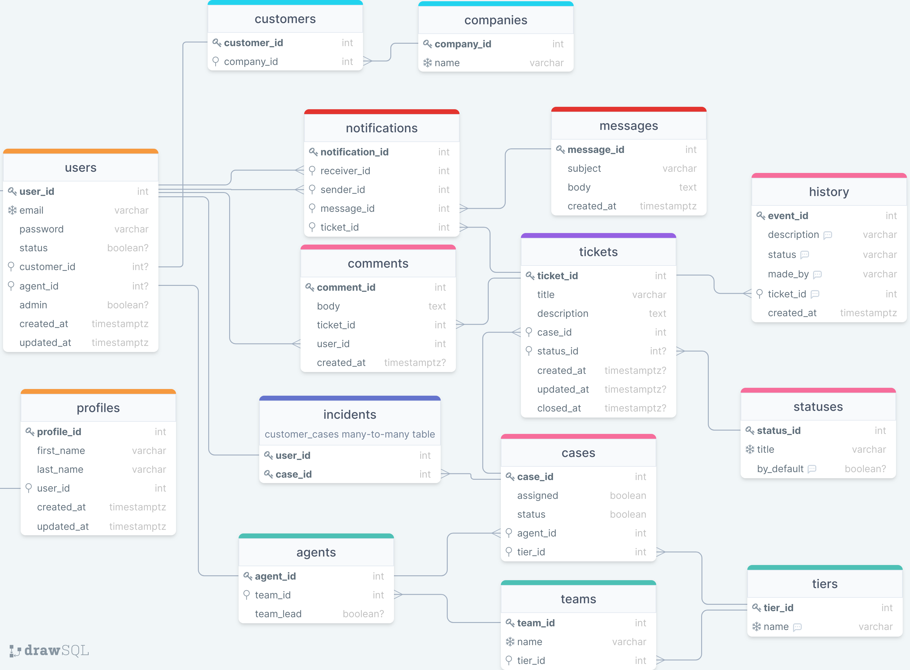

# Ticketing System | Technical Test at Telus

This is a sample project started as a technical test.

Tech Stack used in this project:

- [Golang 1.18](https://go.dev)
- [React 18.1.0](https://reactjs.org/)
- [PostgreSQL 14.3](https://www.postgresql.org)
- [Redis 7.0.0](https://redis.io/)
- [Docker 20.10.16](https://www.docker.com/get-started)
- [Docker Compose 2.5.0](https://docs.docker.com/compose/)
- [Ubuntu](https://ubuntu.com/)

## Database ER-Diagram

[Live Diagram](https://drawsql.app/clever-solutions/diagrams/telustickets)



## Using Docker Compose

### Clone

```sh
git clone git@github.com:brxyxn/ticketing-system-telus.git
cd ticketing-system-telus
```

### Docker Swarm

Initialize docker swarm

```sh
docker swarm init
```

In case you have multiple network ids, please specify the `--advertise-addr` flag.

```sh
docker swarm init --advertise-addr # format: <ip|interface>[:port]
```

### Docker Secrets

Create your secrets file and specify a secret password, see example:

```sh
echo "secret_password" > pg_secrets.txt
```

`pg_secrets.txt`

```txt
secret_password
```

### Env file

`./.env`

```.env
# backend
PG_HOST=postgres
PG_PORT=5432
PG_USER=telus_user
PG_NAME=telus_db
PG_PASSWORD=secret
PG_SSLMODE=disable

#redis
REDIS_HOST=localhost
REDIS_PORT=6379
REDIS_NAME=0
REDIS_PASSWORD=

# pgadmin
PGADMIN_EMAIL=admin@admin.com
PGADMIN_PASSWORD=admin
```

### Execute

```sh
docker-compose up --build
# or
docker compose up --build
```

### Open

Open your browser and enter to [localhost:3000](http://localhost:3000/)
